# What drives the price of a car?

**OVERVIEW**

In this application, we will explore a dataset from kaggle. The original dataset contained information on 3 million used cars. The provided dataset contains information on 426K cars to ensure speed of processing.  The goal is to understand what factors make a car more or less expensive.  As a result of this analysis, wer'e going to provide clear recommendations to the client -- a used car dealership -- as to what consumers value in a used car.

To frame the task, throughout this practical applications we will refer back to a standard process in industry for data projects called CRISP-DM. This process provides a framework for working through a data problem. 
Next sections will show the CRISP-DM Steps applied to mentioned topic

## Business Understanding

We will be working on a data set of 426K records that have been given to us in csv format that contains information about cars with different characteristics used in different states and regions of the country, we are going to perform data engineering and feature engineering to transform the data in a way that facilitates its processing for our model and to know which are the main components that most influence the price of a vehicle and to be able to give these recommendations to our client.

## Data Understanding

* Identify important information about how many rows and columns we have to process, what kind of column types we have.
* We explore how many null values we have and what percentage they have within each feature.
  * 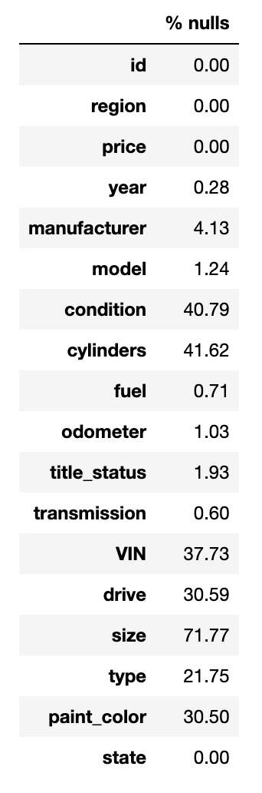
* We continue exploring each column to know what values we have and how they are distributed
    * Year Information:
      * We can see that most of the Cars are from 1990 to 2019
      * 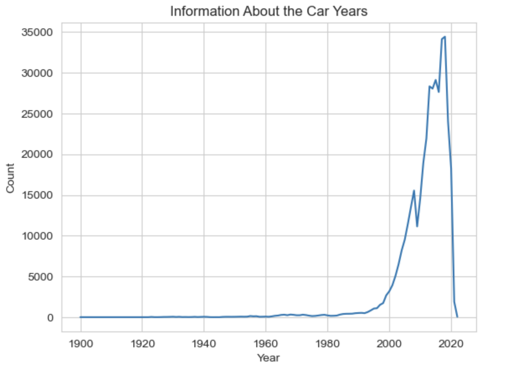
    * Total Manufactures:41
    * Min and Max Price: 0 - 3736928711
    * We have 6 conditions and this is a Categorical Feature (Ordinal)
    * We have 5 Fuels and this is a Categorical Feature (Nominal)
    * We have 3 Transmissions and this is a Categorical Feature (Nominal)
    * We have 3 "Drive" and this is a Categorical Feature (Nominal)
    * There are 4 Car Sizes and this is a Categorical Feature (Ordinal)
      * The most common car is full-size
      * 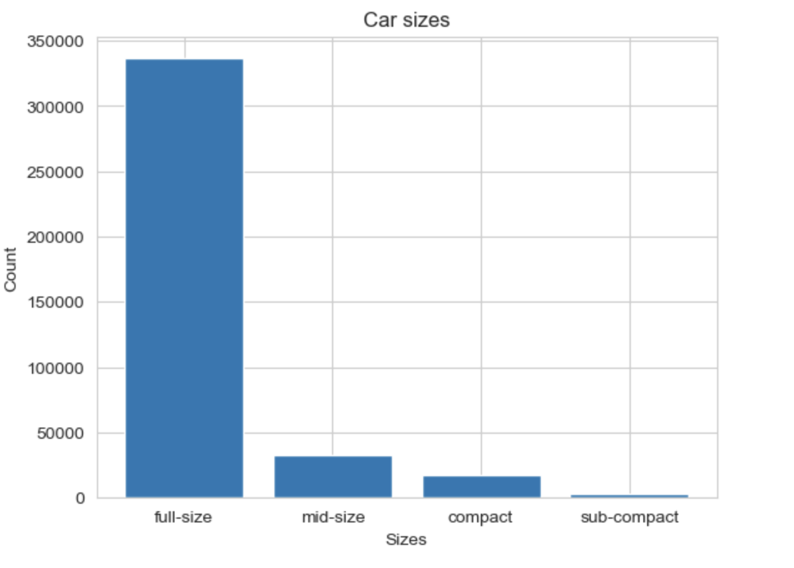
    * There are 12 Colors, the most popular is white.
    * There are 51 states and this is a Categorical Feature (Nominal)
* In this process we were able to identify nominal and ordinal features.
* Review Car prices
  * 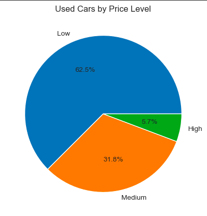

### Data Preparation

In the process of Data preparing we went through several steps:
  * We set the "id" as the index for our dataset
  * I decided to drop de rows with null for columns with few null values in percentage
  * I fill the rest of the columns with the mode
  * Format the data: Some fields need to be formatted in a way that is easier for the model to handle.
  * Transform the Categorical Features identified in the Data Understanding process.
  * Detect and Remove Outliers. Locate the upper and lower fence.
  * Price Distribution
    * 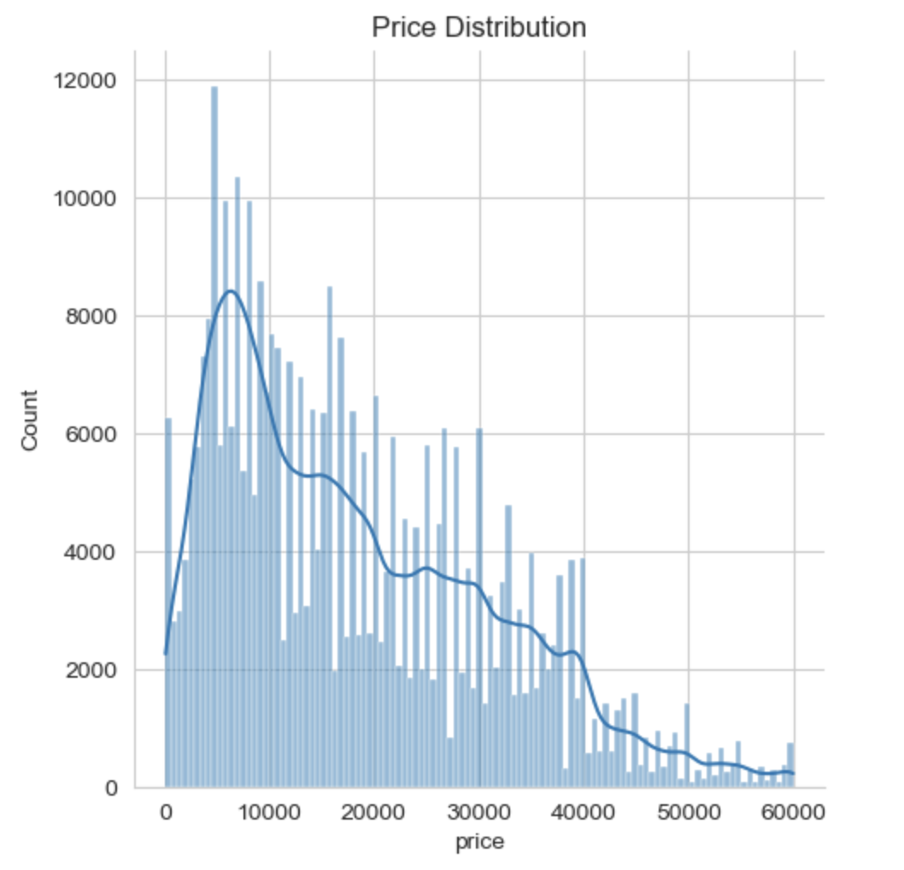
    * Convert price to logarithmic value
    * 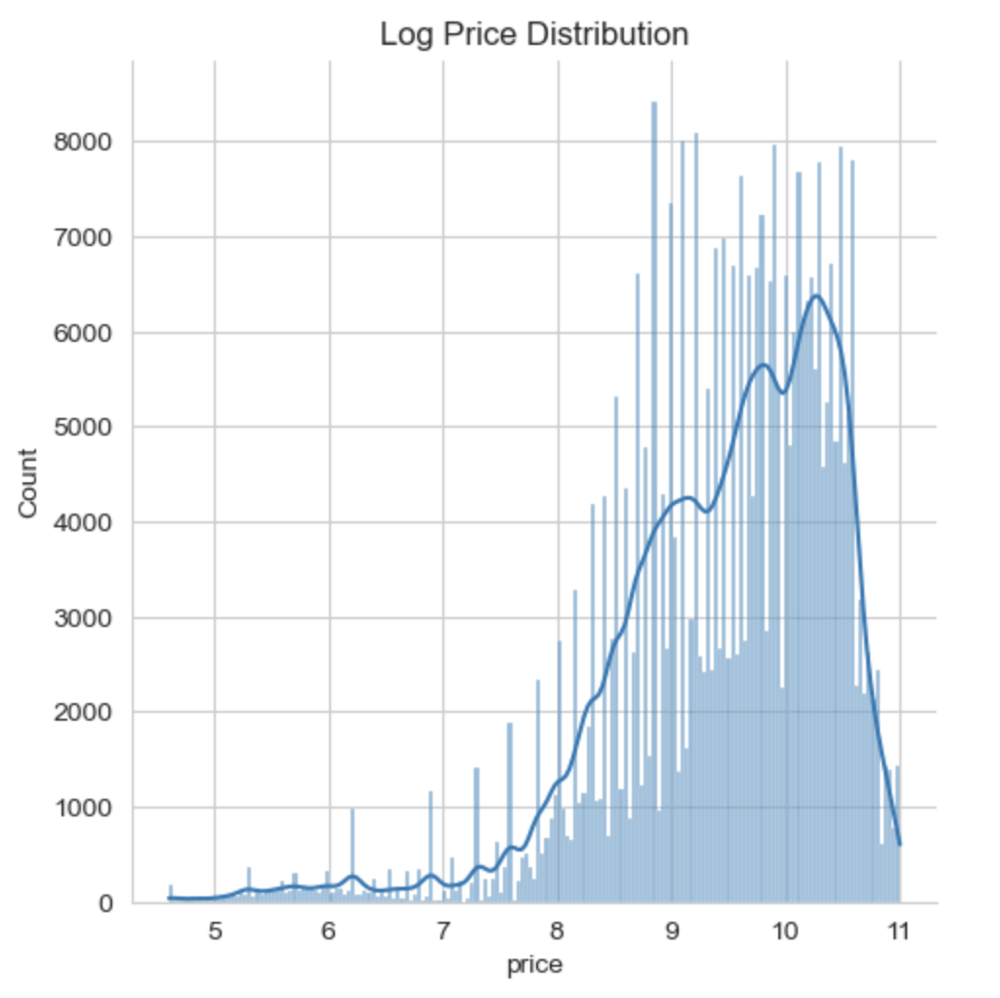

### Modeling

I evaluated the following models by obtaining the MSE for the training and test data set.

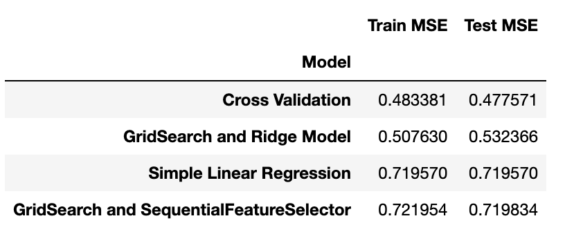

First I started by splitting the data with the train_test_split in test and training data. Once I have done that, I applied the Simple Linear Regression model, I got the following results.
  Train MSE:  0.71
  Test MSE:  0.71

Later I tested a model with Cross Validation, the best degree for the polinomial features was 3
  Train MSE 0.48
  Test MSE: 0.47

I then implemented a Ridge regression model using GridSearch to find the best alpha was 10

Ridge Train MSE:  0.51
Ridge Test MSE:  0.53

Finally I used Sequential Feature selection, I got the best_estimator where I got 11 features with their coefficients for the best_estimator.

Train MSE Sequential Feature Selector: 0.7219539225170251
Test MSE Sequential Feature Selector: 0.7198336633732323

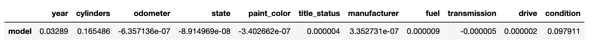

This is a plot comparing the results, The best model was the Cross Validation model.

* 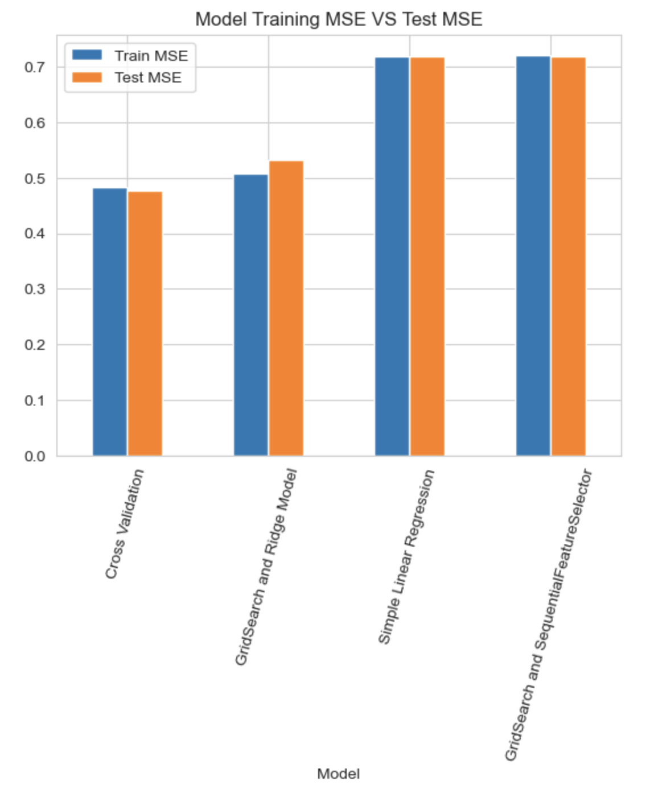

### Permutation Error

I performed the permutation importance with a repetition of 30, this was the result:

* 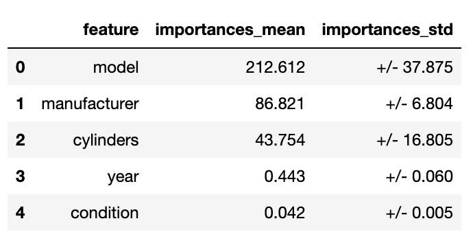

Especially the model, manufacturer and cylinders have a great importance on the price.

Next, I heatmapped the correlation matrix between those features in the original data set and got the following results:
     *we have a positive correlation between features and price.
     * the greatest correlation is with the year.

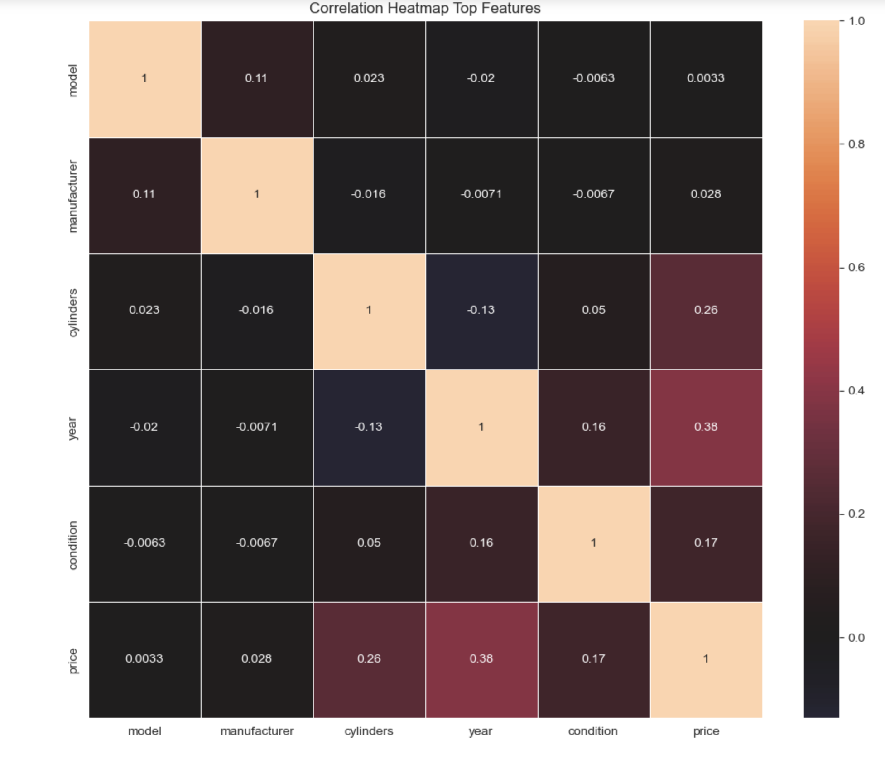

### Evaluation

After analyzing the data set you sent me, I came to the following conclusions:

The three most important features are:
The following characteristics have a high relationship with the price of the vehicles, the idea is that each person can refine their repertoire of vehicles according to these characteristics if they wish with the aim of obtaining better income.

Model: It is the characteristic that seems most important to us in relation to the price of a car, in this way I will show you the top 10 of the most popular used cars with a high price:

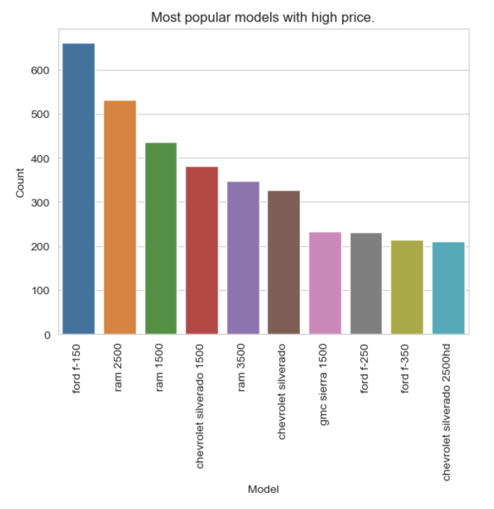

Manufacturer: The top 3 manufacturers that have cars with high prices are Ford, Chevrolet and Ram.

Cylinders: 6 and 8 cylinder cars have almost the entire percentage of the relationship with high priced vehicles

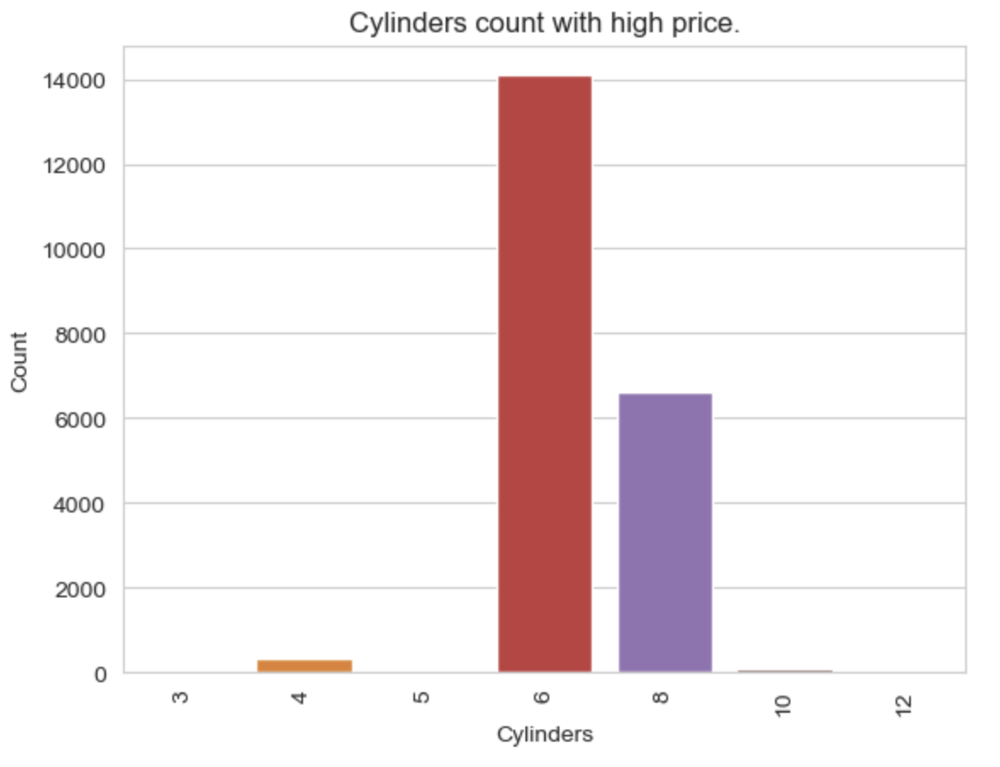

### Next steps

* Analyze information with more complex models

* Each car dealership can refine their vehicle repertoire with the goal of having cars that generate greater profits.